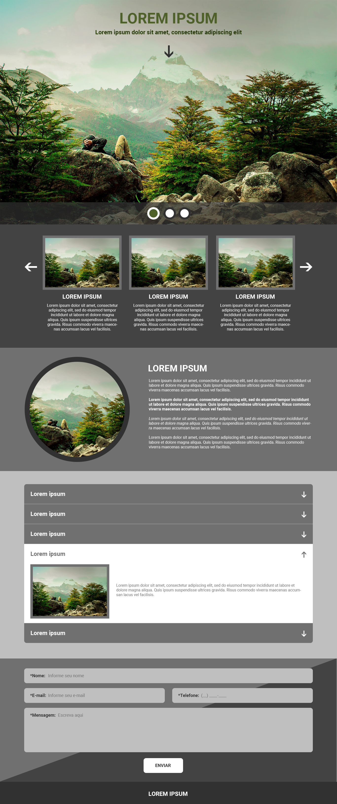

# Projeto teste para vaga de front end na Dot Digital Group

### Nesse projeto vou construir uma interface interativa, com carrouseis em JS puro!

Estou utilizando para esse projeto

<ul>
    <li>Javascript - ES6</li>
    <li>CSS3</li>
    <li>HTML 5</li>
    <li>Gulp</li>
    <li>Eslint</li>
</ul>

### Para fazer o build do projeto utilizar o comando

**npm run build**

### Caso queira acessar o projeto utilizar o live-server

## Imagem do projeto

